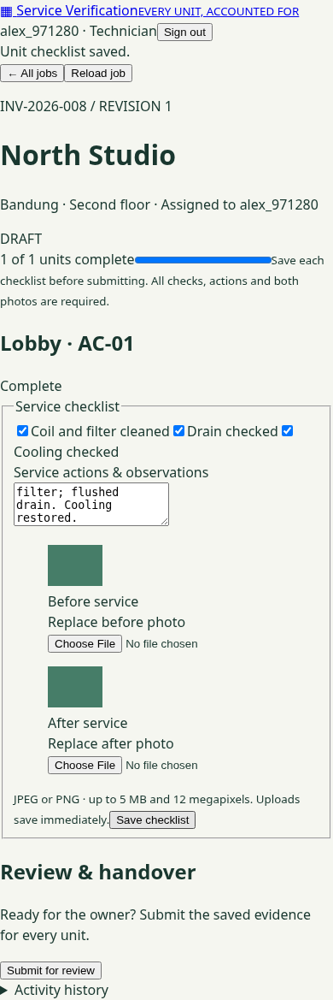
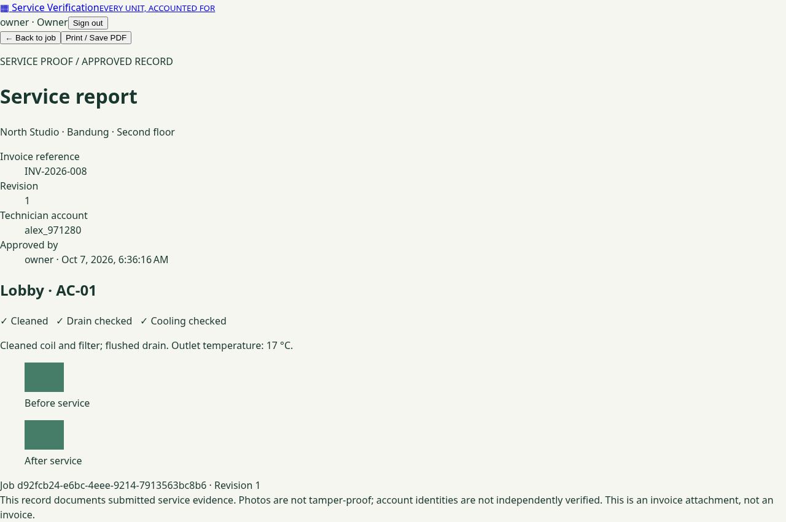

# Service Verification

**Every unit, accounted for.** A compact service-evidence workspace for a small AC servicing business: assign a job, document each unit, correct the record, approve it, and print an immutable revision as an attachment to an external invoice.

This is a portfolio release with a complete, tested core workflow. It is **not a claim of production readiness or validated demand**. No invoice engine, payments, GPS, electronic signatures, offline sync, native Android app, payroll, stock, routing, or marketplace.





[Generated print PDF](evidence/service-report.pdf)

## Start locally in a cloud development environment

Requirements: Docker Engine with Compose. The application binds only to `127.0.0.1:8080`; PostgreSQL is not published. Do not install anything on a low-memory personal computer just to run this project.

```bash
cp .env.example .env
# Edit .env: choose unique DB_PASSWORD and OWNER_PASSWORD values.
# OWNER_PASSWORD: 14–72 characters, at most 72 UTF-8 bytes.
docker compose up --build -d
```

Open `http://localhost:8080`. Sign in with the owner credentials you set. Expand **Manage technicians**, add a technician, then create a job with an external invoice reference and one label per AC unit. Share the technician password through a private channel. There are no built-in/default accounts.

`COOKIE_SECURE=false` in the example is for loopback HTTP only. For an actual deployment, terminate HTTPS and set `COOKIE_SECURE=true`. No deployment is included or authorized by these instructions.

Owner bootstrap runs only if no owner exists. Changing the environment later does not change an existing password. Keep the original credentials securely; operational account recovery is described in the runbook.

## Five-minute demo

1. Owner: create technician `alex`, customer `North Studio`, location `Second floor`, invoice `INV-008`, units `Reception AC-01` and `Meeting room AC-02`.
2. Technician: sign in in a separate browser profile. Only assigned jobs appear. Check all three items, describe actions and observations, attach a JPEG/PNG before and after photo, and **Save checklist** for each unit.
3. Submit. Missing evidence produces a clear rejection; submitted records are locked.
4. Owner: request changes with a reason. Technician corrects, saves, and resubmits.
5. Owner: approve and open **View approved report**. Use **Print / Save PDF** and attach the PDF to the invoice in your existing billing system.
6. Start a new revision with a reason if a later correction is needed. Revision 1 remains available and unchanged.

Optional fictional fixture creation uses `scripts/demo.mjs`. It refuses remote hosts and requires `DEMO_ACK=LOCAL_DISPOSABLE_ONLY`, `OWNER_USERNAME`, `OWNER_PASSWORD`, and `DEMO_TECH_PASSWORD` in the environment. Run `node scripts/demo.mjs` only against a disposable local instance. It creates a technician and a two-unit draft, never deletes data, never prints passwords, and is never invoked automatically. Fixture photos used in automated QA are synthetic solid-color images, not real service evidence.

## Architecture and versions

One Kotlin / Spring Boot modular backend serves an Angular frontend from the same origin. Spring Security provides session authentication and CSRF protection; simple JDBC transactions lock jobs during updates. PostgreSQL stores normalized operational data, private image bytes, and append-only approved snapshots. Flyway owns schema changes. No Redis, object storage subscription, or separate microservices are required.

| Component | Pin |
| --- | --- |
| JVM | 21; runtime image pinned by digest |
| Spring Boot | 3.5.16 |
| Kotlin | 1.9.25, managed by the pinned Boot parent |
| Security maintenance overrides | Jackson 2.21.7, Tomcat 10.1.60, PostgreSQL JDBC 42.7.13 |
| Maven | 3.9.11, wrapper archive SHA-256 checked |
| Angular / CLI | 21.2.25 |
| Node | 24.19.0 |
| TypeScript / RxJS | 5.9.3 / 7.8.2 |
| PostgreSQL | 17.11, image pinned by digest |
| Playwright | 1.56.1 |

`package-lock.json` locks frontend transitive dependencies; the Boot BOM pins managed JVM dependencies. All container base images have immutable digests. These are reproducible selections, not a promise that they are the newest or free of vulnerabilities. Compatibility was checked using the official [Spring Boot 3.5 requirements](https://docs.spring.io/spring-boot/3.5/system-requirements.html), [Angular version matrix](https://angular.dev/reference/versions), Maven Central metadata and npm package metadata on 2026-10-07. See [architecture decisions](docs/architecture.md).

## Verification

The backend tests use **real PostgreSQL**, never H2. They truncate a dedicated test database; the database name must end in `_test`. Do not point them at customer data.

```bash
export DB_PASSWORD='your-disposable-database-password'
export OWNER_USERNAME=owner
export OWNER_PASSWORD='your-disposable-owner-password'
export COOKIE_SECURE=false
docker run --rm -d --name service-verification-test-db \
  -e POSTGRES_DB=serviceproof_test -e POSTGRES_USER=serviceproof \
  -e POSTGRES_PASSWORD="$DB_PASSWORD" -p 127.0.0.1:5432:5432 \
  postgres:17.11-alpine@sha256:b0f9560a2de083e2cc7382e75f808c7381a32852a7ec49117deedb300e552b24
# Wait for pg_isready before testing; use a free port if 5432 is occupied.
# Optional: TEST_DB_URL=jdbc:postgresql://localhost:5432/serviceproof_test
scripts/verify.sh
```

This runs `npm ci`, TypeScript, frontend tests, the Angular production build, Kotlin compilation, Flyway migration and backend integration tests. It packages the UI in the executable JAR.

For browser tests, run the packaged JAR against a **different disposable** database (`serviceproof_e2e`), with the same owner environment variables. Then:

```bash
cd frontend
npx playwright install --with-deps chromium
BASE_URL=http://localhost:8080 npm run e2e
# If browser downloads are blocked and Chromium is installed:
# CHROMIUM_PATH=/usr/bin/chromium BASE_URL=http://localhost:8080 npm run e2e
```

The GitHub Actions workflow runs these checks and a container build. The separate manual release workflow produces a downloadable image artifact; it does not push to a registry or deploy. An artifact is a release candidate only after the Verify workflow passes for that exact commit. [Actual QA evidence and limitations](docs/qa.md) distinguish local results from unexecuted GitHub checks.

## Security and launch boundary

Assignment checks cover job details, writes, images and historical reports. Images have no public URLs, are size/pixel bounded, decoded and re-encoded as JPEG, and served with `no-store`. Database transactions combine state/version guards with row locks. Approved report rows reject SQL updates/deletes. Passwords are BCrypt hashes; secrets come from environment variables. CSRF, HttpOnly/SameSite cookies, CSP, and bounded single-instance sign-in/public request limits are enabled. JSON bodies and photo storage also have explicit limits; storage failures return safe retry guidance.

The app does not establish that photos are authentic or tamper-proof, or independently verify account identities. The database administrator can alter the database. Printed PDFs are private exports whose onward handling is the owner’s responsibility. Before customer use, resolve account recovery/deactivation, independent security review, ongoing vulnerability review, HTTPS/edge rate limits, encrypted/offsite backups, retention, privacy consent and operational monitoring. See the [runbook](docs/runbook.md) and [security review](docs/security-review.md).

## Why this product?

The customer and buying intent are hypotheses. [Sejasa’s AC warranty information](https://www.sejasa.com/blog/list-garansi-service-ac/) provides context for documenting service and follow-up; it is not evidence that businesses will pay for this software. The release follows the narrow-outcome reasoning in [Jason Cohen’s SLC framework](https://longform.asmartbear.com/slc/). The delight hypothesis is quick per-unit completion and a useful handover document, not feature count. [Scope and acceptance criteria](docs/slc.md) define the boundary and the next customer-learning question.

Documentation: [API](docs/api.md) · [Architecture / ADRs](docs/architecture.md) · [Runbook](docs/runbook.md) · [QA](docs/qa.md) · [SLC](docs/slc.md)
